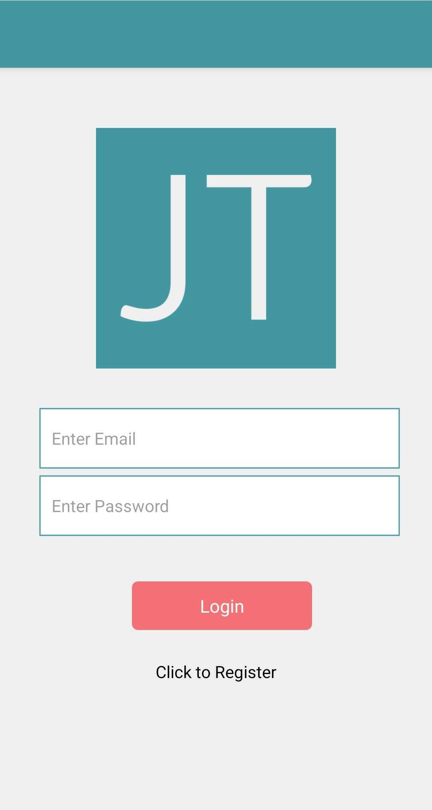
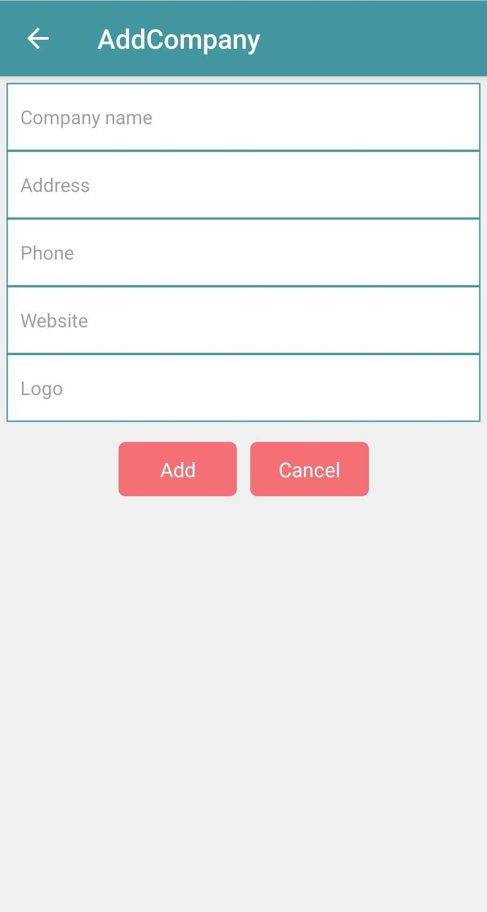
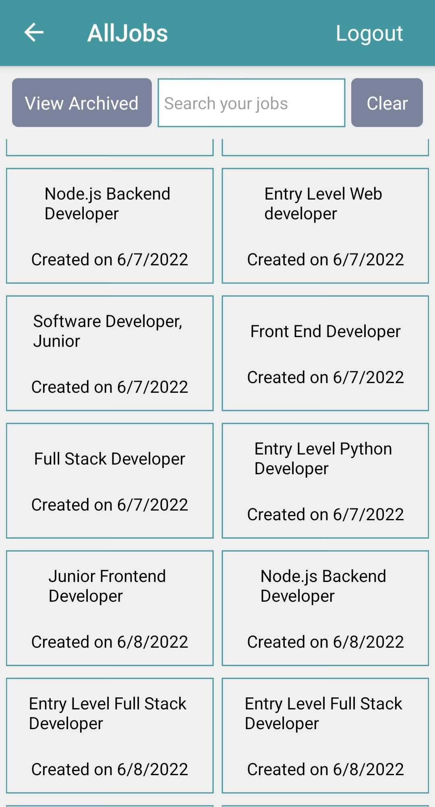

# JobTracker

## Description
This is the React-Native version of my [original JobTracker app](https://github.com/bthalpin/Job-Tracker) created using React.

In the fast paced job hunting world, it can be difficult to keep track of all the information for the jobs that you are applying to. JobTracker is an easy to use app where you can save job postings to allow you to quickly and easily organize your job opportunities. Make use of the job post scraping feature to quickly grab some information from the posting to help you fill out the description.

## Table of Contents

[Link](#link)

[Media](#media)

[Installation](#installation)

[Usage](#usage)

[License](#license)

[Contributing](#contributing)

[Tests](#tests)

[Questions](#questions)

## Link
[JobTracker - Android App](https://play.google.com/store/apps/details?id=com.halpin.jobtracker&pcampaignid=pcampaignidMKT-Other-global-all-co-prtnr-py-PartBadge-Mar2515-1)

[JobTracker - Web App](https://job-tracker-bh.herokuapp.com/)

[JobTracker - Web App -Source Code](https://github.com/bthalpin/Job-Tracker)

## Media

## Installation
To install the necessary dependencies, run the following command:

    npm install

## Usage
After downloading the repo, run npm i to install, and run npm run develop to run JobTracker locally.

## License
This product is licensed under MIT

## Contributing
None

## Tests
To run tests, run the following command:

    npm test

## Questions
If you have any questions about the repo, open an issue or contact me directly at <brian.t.halpin@gmail.com>. You can find more of my work at [Brian Halpin](https://github.com/bthalpin).
